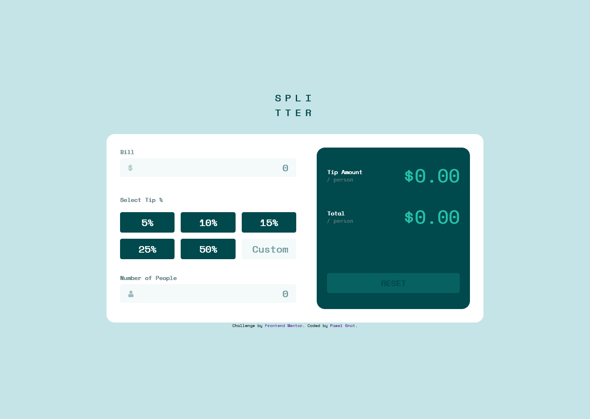

# Frontend Mentor - Tip calculator app solution

This is a solution to the [Tip calculator app challenge on Frontend Mentor](https://www.frontendmentor.io/challenges/tip-calculator-app-ugJNGbJUX). Frontend Mentor challenges help you improve your coding skills by building realistic projects.

## Table of contents

- [Overview](#overview)
  - [Screenshot](#screenshot)
  - [Links](#links)
- [My process](#my-process)
  - [Built with](#built-with)
  - [What I learned](#what-i-learned)
- [Author](#author)

## Overview

### Screenshot

### Links

- Live Site URL: [Frontend Mentor Tip calculator app](https://pawel-gnat.github.io/Frontend-Mentor-Tip-calculator-app/)

## My process

Java Script:

1. If all inputs are empty or not selected disable reset button else set button to working state
2. If custom or bill number input contains string or some kind of calc display error "Not a number" or if contains negative value display "Negative value"
3. If tip input was selected and you want to change it to custom than remove checked state from declared value input
4. If custom input contains some value and you want to change it to declated tip value input, it resets to custom state again
5. If people input contains string or some kind of calc display error "Not a number" or if contains negative value display "Negative value" or if contains "zero" value display "Can't be zero"
6. Calculate tip amount by declaring custom value and divide by number of people or by calculating the percent of bill
7. Calculate total value by adding calculated tip amount and divided bill value by number of people

### Built with

- Semantic HTML5 markup
- CSS custom properties
- Flexbox
- Grid
- Mobile-first workflow
- JavaScript

### What I learned

This app took me 21,5 hours of coding. I practiced my JS skills. I added error handling with text messages near inputs.

Done is better than perfect, but I still find few errors here. My Java Script code could be written better, anyway I tried my best at this moment. I hope I will refacture it later.

## Author

- Frontend Mentor - [@Pawel-Gnat](https://www.frontendmentor.io/profile/Pawel-Gnat)
